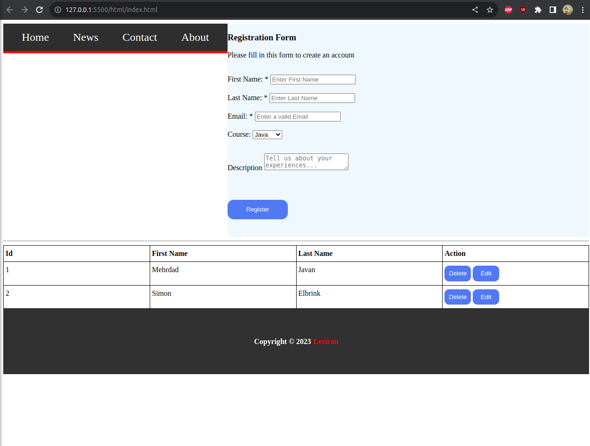

# Lexicon html excercise

#### Wanted to practice CSS Grid.

[Learn CSS Grid - A 13 Minute Deep Dive - Slaying The Dragon - YouTube](https://www.youtube.com/watch?v=EiNiSFIPIQE)

[A Complete Guide to CSS Grid - Chris House](https://css-tricks.com/snippets/css/complete-guide-grid/#aa-introduction)

#### Wanted to practice data tables with CSS Grid

[Responsive data tables with CSS Grid - Daniel Salvado - Medium dot Com](https://medium.com/evodeck/responsive-data-tables-with-css-grid-3c58ecf04723)

### GitHub Pages site

[https://gogofc.github.io/lexicon-html/](https://gogofc.github.io/lexicon-html/)

---

| Things to look into | Site |
| --- | --- |
| [CSS Grid Layout Module](https://www.w3schools.com/css/css_grid.asp) | w3schools.com |
| [Grid Layout](https://www.w3schools.com/css/tryit.asp?filename=trycss_grid_layout_named) | w3schools.com tryit |
| [LEARN CSS GRID](https://learncssgrid.com/) | learncssgrid.com |

---

## Problem I ran into.

